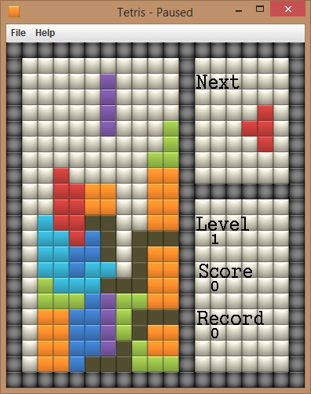

# Simple Snake Game in Java

This is fresh repo for my old code of Snake Game. This was developed by me in Jul 16th, 2015.

# Specification

Tetris is written in pure Java code. Also using some ArrayList, Graphics and Container Classes.

# Command to run

```sh
$ javac Tetris.java
$ java Tetris
```

# Below are the screenshots of the same.



# Author

[Bhagyesh Sunil Patel][1]

[1]: https://github.com/uzrnem
# tetris-java-game
